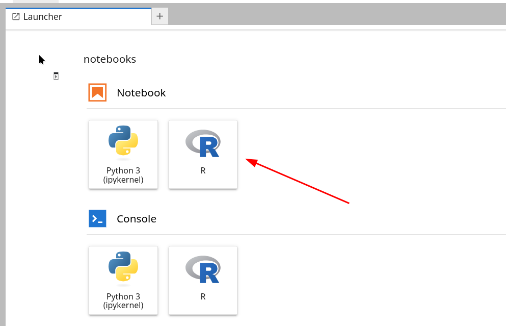
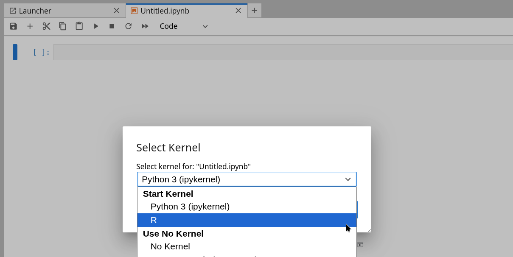

# r-for-data-science

This repository creates a Docker image containing an R environment with JupyterLab allowing one to run the first 7 chapters of the R for Data Science book: https://r4ds.hadley.nz/.

## Prerequisites

You need [Docker Engine (or Docker Desktop)](https://docs.docker.com/engine/) and [GNU Make](https://www.gnu.org/software/make/manual/make.html) installed locally.

## Clone the repository

To begin, clone this repository:

```
git clone git@github.com:vikineema/r-for-data-science.git
cd r-for-data-science
```

## Usage

To start a container with the environment running:
1. Build the image using the make command `make build`
2. Run the container using the make command `make up`

Copy the following url `http://localhost:8888/?token=""` and paste it into your browser. 
To run a notebook with the R kernel you can:
1. Launch a R kernel notebook from the launcher



2. Open an notebook and select the R kernel when prompted from the Select Kernel dialogue box.

